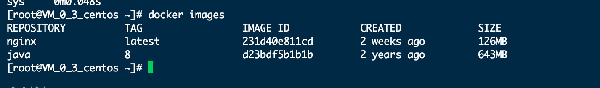

### 一、Docker 环境安装
- 安装yum-utils：
```
yum install -y yum-utils device-mapper-persistent-data lvm2
```
- 为yum源添加docker仓库位置：
```
yum-config-manager --add-repo https://download.docker.com/linux/centos/docker-ce.repo
```
- 安装docker:
```
yum install docker-ce
```
- 启动docker:
```
systemctl start docker
```

### 二、Docker 镜像常用命令
- 搜索镜像
```
docker search 镜像名
```
- 下载镜像
```
docker pull java:8
```
> 例：docker pull 镜像名:版本号 （不带版本号则为`latest`最新版本）。由于docker search命令只能查找出是否有该镜像，不能找到该镜像支持的版本，所以需要通过[docker hub](https://hub.docker.com)来搜索支持的版本。

- 查看已有镜像
```
docker images
```


- 删除指定镜像
```
'docker rmi 镜像名:版本号' 或 'docker rmi imageID'
```
> `ocker rmi -f 镜像名:版本号`: -f 强制删除

- 删除所有没有引用的镜像
```
docker rmi `docker images | grep none | awk '{print $3}'`
```
- 强制删除所有镜像
```
docker rmi -f $(docker images)
```
#### 修改Docker镜像的存放位置
- 查看容器的存放地址
```
docker info | grep "Docker Root Dir"
```
- 关闭Docker服务：
```
systemctl stop docker
```
- 移动目录到目标路径
```
mv /var/lib/docker /mydata/docker
```
- 建立软连接
```
ln -s /mydata/docker /var/lib/docker
```
### 三、Docker 容器常用命令
#### 新建并启动容器
```
docker run -p 80:80 --name nginx -d nginx:latest
```
- -d选项：表示后台运行
- --name选项：指定运行后容器的名字为nginx,之后可以通过名字来操作容器
- -p选项：指定端口映射，格式为：hostPort:containerPort

#### 查看容器
- 查看运行中的容器
```
docker ps
```
- 查看所有容器
```
docker ps -a
```
#### 停止容器
```
docker stop $ContainerName(或者$ContainerId)
```
#### 强制停止
```
docker kill $ContainerName(或者$ContainerId)
```
#### 启动已存在的容器
```
docker start $ContainerName(或者$ContainerId)
```
#### 进入容器
- 先获取容器的ID
```
docker inspect --format "{{.State.Pid}}" $ContainerName(或者$ContainerId)
```
- 根据容器的PID进入容器：
```
nsenter --target "$pid" --mount --uts --ipc --net --pid
```
#### 删除容器
- 删除指定容器
```
docker rm $ContainerName(或者$ContainerId)
```
- 按名称删除容器
```
docker rm `docker ps -a | grep nginx* | awk '{print $1}'`
```
- 强制删除所有容器
```
docker rm -f $(docker ps -a -q)
```
#### 查看容器日志
- 查看当前全部日志
```
docker logs $ContainerName(或者$ContainerId)
```
- 动态查看日志
```
docker logs $ContainerName(或者$ContainerId) -f
```
#### 获取容器IP地址
```
docker inspect --format '{{ .NetworkSettings.IPAddress }}' $ContainerName(或者$ContainerId)
```
#### 同步宿主机时间到容器
```
docker cp /etc/localtime $ContainerName(或者$ContainerId):/etc/
```
#### 宿主机查看docker使用cpu/内存/网络/io情况
- 查看指定容器
```
docker stats $ContainerName(或者$ContainerId)
```
- 查看所有容器
```
docker stats -a
```
#### 查看Docker磁盘使用情况
```
docker system df
```
#### 进入Docker容器内部的bash
```
docker exec -it $ContainerName /bin/bash
```
### 四、镜像加速
>针对Docker客户端版本大于 1.10.0 的用户,使用国内阿里云镜像容器加速服务：
```
sudo mkdir -p /etc/docker
sudo tee /etc/docker/daemon.json <<-'EOF'
{
  "registry-mirrors": ["https://tlzxzjzb.mirror.aliyuncs.com"]
}
EOF
sudo systemctl daemon-reload
sudo systemctl restart docker
```
